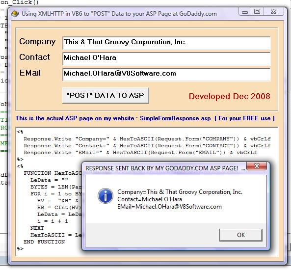



## SUBMIT FORM DATA TO AN ASP PAGE ON YOUR WEB SITE

### Description

A simplified VB6 program to illustrate the use of XML HTTP (XMLHTTP) to POST data to your ASP page on your web site and avoid issues that arise with various characters and memo field data.

My previous submission was, perhaps, too complicated, so this stripped down version that actually includes the ASP Scripting in a TEXT BOX makes it much easier to understand.

Enjoy and remember please, do vote early and often. (LOL)

Cheers Good People. Kevin Ritch, V8Software
 
### More Info
 

             |
---                |---
**Submitted On**   |2008-12-10 23:18:44
**By**             |[Kevin Ritch](https://github.com/Planet-Source-Code/PSCIndex/blob/master/ByAuthor/kevin-ritch.md)
**Level**          |Advanced
**User Rating**    |5.0 (10 globes from 2 users)
**Compatibility**  |VB 6\.0, ASP \(Active Server Pages\) 
**Category**       |[Complete Applications](https://github.com/Planet-Source-Code/PSCIndex/blob/master/ByCategory/complete-applications__1-27.md)
**World**          |[Visual Basic](https://github.com/Planet-Source-Code/PSCIndex/blob/master/ByWorld/visual-basic.md)
**Archive File**   |[SUBMIT\_FOR21367312102008\.zip](https://github.com/Planet-Source-Code/kevin-ritch-submit-form-data-to-an-asp-page-on-your-web-site__1-71510/archive/master.zip)

